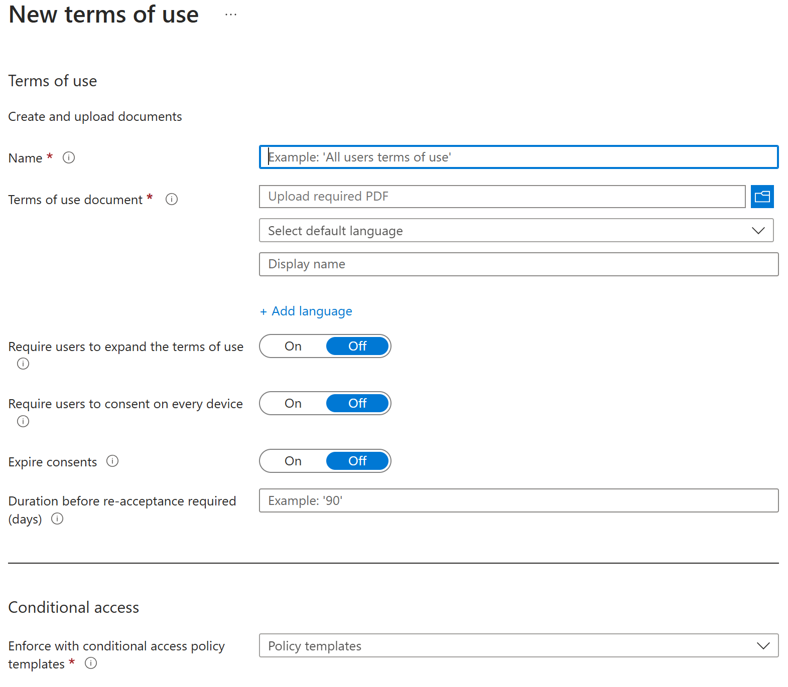
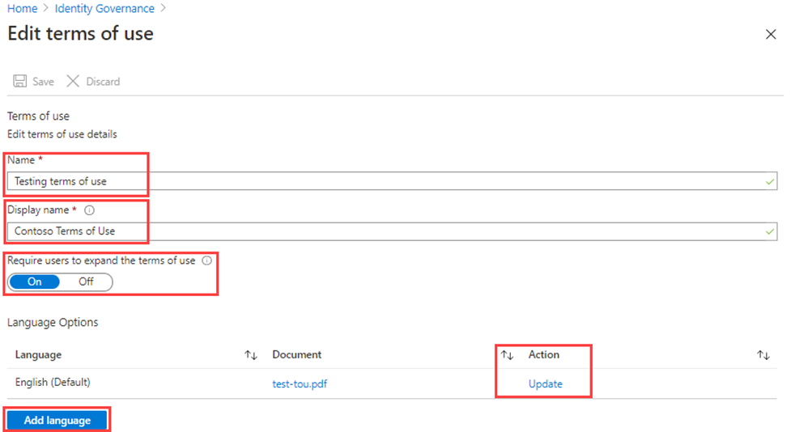

---
lab:
  title: "Labo\_3\_: ajouter un rapport d’acceptation des conditions d’utilisation"
  module: 'Module : Deploying access using Microsoft Entra entitlement management'
---

# Labo 3 : ajouter un rapport d’acceptation des conditions d’utilisation 

## Scénario de labo

Les stratégies de Conditions d’utilisation de Microsoft Entra offrent aux organisations une méthode simple pour présenter des informations aux utilisateurs finaux. Cette présentation permet de garantir que les utilisateurs voient les clauses d’exclusion de responsabilité nécessaires au respect des conditions légales ou de conformité. Cet article vous montre comment démarrer avec les stratégies de conditions d’utilisation. Vous devez créer et appliquer une stratégie de conditions d’utilisation pour votre organisation.

#### Durée estimée : 20 minutes

### Exercice 1 - Configurer des conditions d’utilisation et les tester

#### Tâche 1 - Ajouter des conditions d’utilisation

 **Important** : pour utiliser et configurer les conditions d’utilisation de Microsoft Entra ID, vous devez disposer des éléments suivants :
 - Abonnement Microsoft Entra ID Premium P1, P2, EMS E3 ou EMS E5.
 - Si vous n’avez pas l’un de ces abonnements, vous pouvez obtenir la version d’évaluation de Microsoft Entra ID Premium.
 - Un des comptes d’administrateur suivants pour le répertoire que vous souhaitez configurer :
  - Administrateur général
  - Security Administrator
  - Administrateur de l’accès conditionnel

1. Connectez-vous à [https://entra.microsoft.com](https://entra.microsoft.com) en utilisant un compte d’administrateur général.

2. Dans le menu de navigation de gauche, ouvrez et sélectionnez  **Gouvernance des identités**.

3. Dans le menu, sous **Gestion des droits d’utilisation**, sélectionnez **Conditions d’utilisation**.

4. Dans la page Conditions d’utilisation, dans le menu supérieur, sélectionnez **+ Nouvelles conditions**

    

5. Dans la zone **Nom**, entrez **Conditions d’utilisation du test**.

    **Remarque** : ce sont les conditions d’utilisation à utiliser dans le portail Azure.

6. Sélectionnez la **case du document Conditions d'utilisation**, recherchez votre PDF de conditions d'utilisation finalisé et sélectionnez-le.

   **Fichier de conditions d’utilisation fourni** : accédez au référentiel GitHub **AllFiles/Labs/Lab3** pour obtenir un exemple de document PDF de conditions d’utilisation à utiliser dans ce labo.

7. Dans la zone **Nom d’affichage**, entrez **Conditions d’utilisation de contoso**.

    **Remarque** : il s’agit du titre que les utilisateurs voient quand ils se connectent.

8. Sélectionnez **Anglais** comme langue de votre document Conditions d’utilisation.

   **Remarque** : l’option de langue vous permet de charger plusieurs conditions d’utilisation, chacune dans une langue différente. La version des conditions d’utilisation affichée pour l’utilisateur final dépend des préférences de son navigateur.

9. Pour demander aux utilisateurs finaux d’afficher les conditions d’utilisation avant de les accepter, définissez **Demander aux utilisateurs d’étendre les conditions d’utilisation** sur **Activé**.

10. Pour demander aux utilisateurs finaux d’accepter vos conditions d’utilisation sur chaque appareil à partir duquel l’accès leur est octroyé, définissez **Demander le consentement des utilisateurs sur chaque appareil** sur **Désactivé**. Les utilisateurs peuvent être amenés à installer des applications supplémentaires si cette option est activée.

    **Avertissement** : les utilisateurs devront enregistrer chaque appareil avec Microsoft Entra ID avant de pouvoir obtenir le consentement sur chaque appareil. Il est recommandé de définir ce paramètre sur Activé. Toutefois, pour les besoins de ce labo, nous le laisserons sur Désactivé.

11. Si vous voulez faire expirer les consentements pour les conditions d’utilisation selon une planification, définissez **Faire expirer les consentements** sur **Activé**. Si la valeur Activé est définie, deux paramètres de planification supplémentaires sont affichés.

12. Utilisez les paramètres **Expiration commençant le** et **Fréquence** pour spécifier la planification régissant l’expiration des conditions d’utilisation. Le tableau suivant présente deux exemples de paramètres et leur résultat :

    | Expiration commençant le | Fréquence | Résultat |
    |---|---|---|
    | Date du jour | Mensuelle | À compter d’aujourd’hui, les utilisateurs doivent accepter les conditions d’utilisation et les réaccepter chaque mois.|
    | Date future | Mensuelle | À compter d’aujourd’hui, les utilisateurs doivent accepter les conditions d’utilisation. Quand la date future survient, les consentements expirent. Les utilisateurs doivent alors réaccepter les conditions d’utilisation chaque mois. |

    Par exemple, si vous définissez « Expiration commençant le » avec la date **1 jan** et la fréquence avec la valeur **Mensuelle**, voici comment les expirations peuvent se produire pour deux utilisateurs :

    | Utilisateur | Date d’acceptation initiale | Première date d’expiration | Deuxième date d’expiration | Troisième date d’expiration |
    |---|---|---|---|---|
    | Alice | 1 jan | 1 fév | 1 mar | 1 avr|
    | Bob | 15 jan | 1 fév | 1 mar| 1 avr |

13. Utilisez le paramètre **Durée avant nouvelle acceptation requise (jours)** pour spécifier le nombre de jours au bout duquel l’utilisateur doit réaccepter les conditions d’utilisation. Les utilisateurs peuvent ainsi suivre leur propre calendrier. Par exemple, si vous définissez une durée de **30** jours, voici comment les expirations peuvent se produire pour deux utilisateurs :

    | Utilisateur | Date d’acceptation initiale | Première date d’expiration | Deuxième date d’expiration | Troisième date d’expiration |
    |---|---|---|---|---|
    | Alice | 1 jan | 31 jan | 2 mar | 1 avr|
    | Bob | 15 jan | 14 fév | 16 mar| 15 avr

    **Remarque** : il est possible d’utiliser les paramètres Faire expirer les consentements et Durée avant nouvelle acceptation requise (jours) ensemble, mais généralement, vous utilisez l’un ou l’autre.

14. Sous **Accès conditionnel**, sélectionnez **Stratégie personnalisée**.

    **IMPORTANT** : les contrôles de stratégie d’accès conditionnel (y compris les conditions d’utilisation) ne peuvent pas être appliqués sur les comptes de service. Nous vous recommandons d’exclure tous les comptes de service de la stratégie d’accès conditionnel.

    Les stratégies d’accès conditionnel personnalisées permettent de définir des conditions d’utilisation plus précises, jusqu’au niveau d’une application cloud ou d’un groupe d’utilisateurs. Pour plus d’informations, consultez [https://docs.microsoft.com/en-us/azure/active-directory/conditional-access/require-tou](https://docs.microsoft.com/en-us/azure/active-directory/conditional-access/require-tou).

15. Lorsque vous avez terminé, sélectionnez **Créer**.

16. Une fois les conditions d’utilisation créées, vous êtes automatiquement redirigé vers la page de Stratégie d’accès conditionnel. Dans la page, dans la zone **Nom** , entrez **Appliquer les conditions d’utilisation**.

17. nsSous **Affectations**, sélectionnez **Aucun utilisateur et groupe sélectionné**.

18. Dans l’onglet inclure, activez la case à cocher **Utilisateurs et groupes**.

19. Dans le volet Sélectionner, sélectionnez **Adele Vance** comme compte à utiliser pour tester la stratégie des conditions d’utilisation.

   **Avertissement** : si vous choisissez votre compte d’administrateur, comme toutes les stratégies d’accès conditionnel, vérifiez que vous disposez d’un autre compte disposant d’autorisations suffisantes pour modifier la stratégie d’accès conditionnel. Cela permet de s’assurer que votre compte administrateur ne sera pas verrouillé si la stratégie d’accès conditionnel entraîne un résultat indésirable.

20. Dans **Ressources cibles**, sélectionnez **Aucune ressource cible sélectionnée**.

21. Sélectionnez **Toutes les applications Cloud**.

22. Dans **Contrôles d’accès** et **Octroi**, sélectionnez **Aucun contrôle sélectionné**.

23. Dans le volet accorder, sélectionnez **Test des conditions d’utilisation**, puis sélectionnez **Sélectionner**.

24. Sous **Activer une stratégie**, sélectionnez **Activé**.

25. Lorsque vous avez terminé, sélectionnez **Créer**.

    

26. Si vous avez choisi d’utiliser votre propre compte, vous pouvez actualiser votre navigateur. Vous êtes invité à vous connecter à nouveau. Quand vous vous connectez, vous devez accepter les conditions d’utilisation.

#### Tâche 2 - Se connecter en tant qu’Adele

1. Ouvrez une fenêtre de navigation privée.
2. Se connecter à https://portal.azure.com.
3. Si un message s’affiche indiquant que vous êtes déjà connecté, sélectionnez le nom de l’utilisateur connecté en haut à droite de l’écran et choisissez **Se connecter avec un autre compte**.
4. Connectez-vous en tant qu’Adele :

    | Setting | Valeur à entrer |
    | :--- | :--- |
    | Nom d’utilisateur | **AdeleV@**`<<your domain name>>.onmicrosoft.com` |
    | Mot de passe | Entrez le mot de passe de l’administrateur du locataire (consultez l’onglet Ressources du laboratoire pour récupérer le mot de passe d’administrateur du locataire) |

5. Validez la connexion d’Adele avec la méthode d’authentification MFA.
6. Consultez les conditions d’utilisation.
7. Vous pouvez choisir **Accepter** ou **Refuser**.

    **Remarque** : si vous choisissez **Refuser**, lors de votre prochaine connexion en tant qu’AdeleV, vous devrez à nouveau afficher et accepter les conditions d’utilisation.

    **Remarque** : les conditions d’utilisation peuvent prendre quelques minutes pour s’afficher. Vous pouvez également vous déconnecter et vous reconnecter au portail.
 
#### Tâche 3 - Afficher le rapport des utilisateurs ayant accepté et refusé les conditions d’utilisation

La page des conditions d’utilisation affiche le nombre d’utilisateurs ayant accepté et refusé les conditions d’utilisation. Ce nombre, ainsi que le nom des personnes ayant accepté ou refusé, sont stockés pour toute la durée de vie des conditions d’utilisation.

1. Dans Microsoft Azure, dans **Gouvernance des identités > Conditions d’utilisation**, recherchez vos conditions d’utilisation.

2. Cliquez sur les chiffres situés sous **Accepté**et **Refusé** pour voir qui a accepté et qui a refusé les conditions d’utilisation.

    

3. Dans cet exercice, vous ne disposez peut-être pas de conditions d’utilisation acceptées ou refusées. Dans l’exemple suivant, la valeur **acceptée** a été sélectionnée. Vous pouvez voir les informations utilisateur signalées pour celles qui ont accepté les conditions d’utilisation.

    

4. Sur la page **Consentements pour les conditions d’utilisation**, sélectionnez **Télécharger** pour télécharger un rapport sur le consentement.

5. Sur la page **Gouvernance des identités | Conditions d’utilisation**, mettez en surbrillance le champ **Tester les conditions d’utilisation** et sélectionnez **Afficher les journaux d’audit sélectionnés** pour afficher l’activité des journaux d’audit.

#### Tâche 4 - À quoi ressemblent les conditions d’utilisation pour les utilisateurs ?

1. Une fois les conditions d’utilisation créées et appliquées, les utilisateurs concernés voient la page des conditions d’utilisation.

    

2. Les utilisateurs peuvent afficher les conditions d’utilisation et, si nécessaire, utiliser les boutons pour effectuer un zoom avant ou arrière.

    

3. Sur les appareils mobiles, les conditions d’utilisation s’affichent comme dans l’exemple suivant.

    

#### Tâche 5 - Consulter les conditions d’utilisation acceptées

Vous pouvez consulter et vérifier les conditions d’utilisation qu’ils ont acceptées en procédant de la façon suivante.

1. Accédez à [https://myapps.microsoft.com](https://myapps.microsoft.com/), puis connectez-vous à l’aide de votre compte d’utilisateur.

2. Sélectionnez la photo de profil de l’utilisateur, puis cliquez sur **Afficher le compte**. Sur la page vue d’ensemble, sélectionnez AFFICHER LES PARAMÈTRES ET LA CONFIDENTIALITÉ.

3. Dans la page Paramètres & confidentialité, sélectionnez l’onglet **Confidentialité** .

4. Sous **Avis de l’organisation**, vous pouvez passer en revue les conditions d’utilisation que vous avez acceptées.

#### Tâche 6 - Modifier les détails des conditions d’utilisation

Vous pouvez modifier certains détails des conditions d’utilisation, mais il n’est pas possible de modifier un document existant. La procédure suivante explique comment modifier les détails.

1. Connectez-vous à  [https://entra.microsoft.com](https://entra.microsoft.com) en tant qu’administrateur global.

2. Ouvrez l’élément Microsoft Entra ID et sélectionnez **Gouvernance des identités** dans le menu.

3. Dans le menu de navigation de gauche, sous **Gestion des droits d’utilisation**, sélectionnez **Conditions d’utilisation**.

4. Sélectionnez les conditions d’utilisation à modifier.

5. Dans le menu du haut, sélectionnez **Modifier**.

6. Dans le volet Modifier les conditions d’utilisation, vous pouvez changer les éléments suivants :

 - **Nom** : nom interne des conditions d’utilisation qui n’est pas partagé avec les utilisateurs finaux
 - **Demander aux utilisateurs d’étendre les conditions d’utilisation** : la définition de cette option sur **Activé** force l’utilisateur final à étendre les conditions d’utilisation avant de les accepter.
 - **Mettre à jour un document des conditions d’utilisation existantes**.
 - Vous pouvez ajouter une langue à des conditions d’utilisation existantes. Si vous souhaitez modifier d’autres paramètres, par exemple obliger les utilisateurs à donner leur consentement sur chaque appareil, faire expirer les autorisations, durée avant acceptation ou stratégie d’accès conditionnel, vous devez créer de nouvelles conditions d’utilisation.

    

7. Une fois que vous avez terminé, cliquez sur **Enregistrer** pour enregistrer vos modifications.

#### Tâche 7 - Mettre à jour un document des conditions d’utilisation existantes

Vous avez peut-être besoin, à l’occasion, de mettre à jour le document sur les conditions d’utilisation.

1. Sélectionnez les conditions d’utilisation à modifier.

2. Sélectionnez **Modifier les conditions**.

3. Dans le tableau **Options de langue**, identifiez les conditions d’utilisation que vous souhaitez mettre à jour, puis, dans la colonne **Action**, sélectionnez **Mettre à jour**.

    

4. Dans le volet Mettre à jour les conditions d’utilisation de la version, vous pouvez télécharger une nouvelle version du document sur les conditions d’utilisation.

5. Il existe également une option à bascule **Exiger une nouvelle acceptation** si vous souhaitez obliger les utilisateurs à accepter cette nouvelle version la prochaine fois qu’ils se connectent. Si vous n’exigez pas de nouvelle acceptation de la part de vos utilisateurs, leur consentement préalable demeure à jour et seuls les nouveaux utilisateurs qui n’ont pas fait part de leur consentement ou dont le consentement arrive à expiration voient la nouvelle version.

    

6. Une fois que vous avez téléchargé votre nouveau pdf et décidé de sa nouvelle acceptation, sélectionnez **Ajouter**.

7. La version la plus récente apparaît alors dans la colonne Document.
