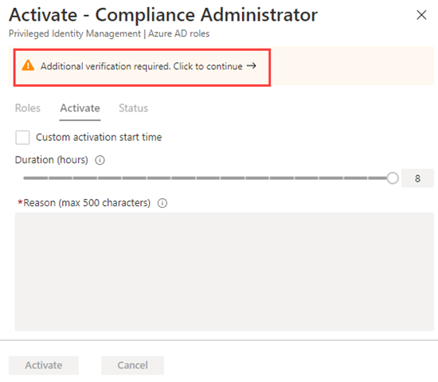

---
lab:
  title: "Labo\_5\_: configurer Privileged Identity Management pour les rôles Microsoft Entra"
  module: 'Module : Deploying access using Microsoft Entra entitlement management'
---

# Labo 5 : configurer Privileged Identity Management pour les rôles Microsoft Entra

## Scénario de labo

Un administrateur de rôle privilégié peut personnaliser Privileged Identity Management (PIM) dans son organisation Microsoft Entra, y compris modifier l’expérience d’un utilisateur qui active une attribution de rôle éligible. Vous devez vous familiariser avec la configuration de PIM.

#### Durée estimée : 30 minutes

### Exercice 1 : Configurer les paramètres du rôle Microsoft Entra

#### Tâche 1 : ouvrir les paramètres de rôle

Suivez ces étapes pour ouvrir les paramètres d’un Microsoft Entra.

1. Connectez-vous à la plateforme  [https://entra.microsoft.com](https://entra.microsoft.com) en tant qu’administrateur global.

2. Recherchez, puis sélectionnez **Privileged Identity Management**.

3. Sur la page Privileged Identity Management, dans la navigation de gauche, sélectionnez rôles **Microsoft Entra**.

4. Sur la page démarrage rapide, dans le volet de navigation de gauche, sélectionnez **Paramètres.**

    

5. Passez en revue la liste des rôles, puis, dans la **Recherche par nom de rôle**, entrez **Compliance**.

6. Dans les résultats, sélectionnez **Conformité administrateur**.

7. Passez en revue les informations détaillées sur les paramètres du rôle.

#### Tâche 2 : demander une approbation pour l’activation

1. Dans la page Détails du paramètre de rôle, dans le menu supérieur, sélectionnez **Modifier**.

    

2. Dans l’écran Modifier le paramètre de rôle : administrateur de la conformité, cochez la case **Exiger l’approbation pour l’activation** .

3. Sélectionnez **Sélectionner des approbateurs**.

4. Dans le volet Sélectionner un membre, sélectionnez votre compte administrateur, puis sélectionnez **Sélectionner**.

    

5. Une fois que vous avez spécifié les paramètres de rôle, sélectionnez **Mettre à jour** pour enregistrer vos modifications.

### Exercice 2 - PIM avec les rôles Microsoft Entra

#### Tâche 1 : attribuer un rôle

Avec Microsoft Entra ID, un Administrateur général peut attribuer des rôles d’administrateur Microsoft Entra permanents. Ces attributions de rôles peuvent être créées à l’aide du Centre d’administration Microsoft Entra ou du Portail Azure, ou en utilisant des commandes PowerShell. Le service Privileged Identity Management (PIM) permet également aux Administrateurs de rôle privilégié d’établir des attributions permanentes du rôle Administrateur. En outre, les Administrateurs de rôle privilégié peuvent rendre les utilisateurs éligibles pour les rôles Administrateur de Microsoft Entra. Un administrateur éligible peut activer le rôle lorsqu’il en a besoin, puis l’autorisation expirera lorsqu’il aura terminé.

Suivez ces étapes pour rendre un utilisateur éligible pour un rôle d’administrateur Microsoft Entra.

1. Connectez-vous à [https://entra.microsoft.com](https://entra.microsoft.com) en utilisant un compte d’administrateur général.

2. Recherchez, puis sélectionnez **Privileged Identity Management**.

    **Remarque** : vous pouvez le trouver dans le menu de Identité : Gouvernance d’identité : Privileged Identity Management.

3. Sur la page Privileged Identity Management, dans la navigation de gauche, sélectionnez rôles **Microsoft Entra**.

4. Sur la page Démarrage rapide, dans le volet de navigation de gauche, sélectionnez **Rôles.**

5. Dans le menu du haut, sélectionnez **+Ajouter des affectations.**

    

6. Sur la page Ajouter des affectations, sous l’onglet **Appartenance** , passez en revue les paramètres.

7. Sélectionnez le menu **Sélectionner un rôle**, puis sélectionnez **Administrateur de conformité**.

8. Vous pouvez utiliser le filtre **Rechercher un rôle par nom** pour vous aider à localiser un rôle.

9. Sous **Sélectionner des membres**, sélectionnez **Aucun membre sélectionné**.

10. Dans le volet Sélectionner un membre, sélectionnez **Miriam Graham**, puis choisissez **Sélectionner**.

11. Sur la page Ajouter des affectations, sélectionnez **Suivant >**.

12. Sous l’onglet **Paramètres**, sous **Type d’affectation**, passez en revue les options disponibles. Pour cette tâche, utilisez le paramètre par défaut **Éligible**.

    - Les attributions éligibles exigent des membres qu’ils effectuent une action pour utiliser ce rôle. Il peut s’agir de procéder à une vérification de l’authentification multifacteur (MFA), de fournir une justification professionnelle ou de demander une approbation aux approbateurs désignés.
    - Les attributions de membres actifs n’exigent pas des membres qu’ils effectuent une action pour utiliser ce rôle. Les membres actifs disposent en permanence des privilèges affectés au rôle.

13. Passez en revue les paramètres restants, puis sélectionnez **Affecter**.

#### Tâche 2 : se connecter avec Miriam

1. Ouvrez une nouvelle fenêtre de navigateur InPrivate.
2. Connectez-vous au centre d’administration Microsoft Entra (https://entra.microsoft.com)).
    **Remarque** : s’il s’ouvre avec un utilisateur connecté, sélectionnez son nom dans le coin supérieur droit et sélectionnez **Se connecter avec un compte différent**.
3. Connectez-vous à Miriam.

   | Champ | Valeur |
   | :--- | :--- |
   | Nom d’utilisateur | **MiriamG@**`<<your domain.onmicrosoft.com>>` |
   | Mot de passe |  Entrez le mot de passe administrateur du locataire (reportez-vous à l’onglet Ressources du labo pour récupérer le mot de passe d’administrateur du locataire). |

**NOTE** : modifiez votre mot de passe lorsque vous y êtes invité.

5. Dans le menu **Identité**, ouvrez **Utilisateurs**, puis sélectionnez **Tous les utilisateurs**.
6. Rechercher **Miriam** dans la liste des utilisateurs
7. Sur la page **Vue d’ensemble**, recherchez les **Rôles attribués**.
8. Sélectionnez les **Affectations éligibles**.
1. Notez que le rôle **Administrateur de conformité** est désormais disponible pour Miriam.

#### Exercice 3 : Activer vos rôles Microsoft Entra

Lorsque vous devez assumer un rôle Microsoft Entra, vous pouvez demander l’activation en ouvrant **Mes rôles** dans Privileged Identity Management.

1. Dans la barre **Recherche, ressources, services et documents**, recherchez Privileged.
2. Ouvrez la page **Privileged Identity Management**.
3. Sur la page Privileged Identity Management, dans le volet de navigation de gauche, sélectionnez **Mes rôles**.

4. Sur la page Mes rôles, passez en revue la liste des **affectations éligibles**.

    

5. Dans la ligne rôle d’Administrateur de conformité, sélectionnez **Activer**.

6. Dans le volet Activer – Administrateur de conformité, sélectionnez **Vérification supplémentaire requise**, puis suivez les instructions pour fournir une vérification de sécurité supplémentaire. Vous ne pouvez vous authentifier qu’une seule fois par session.

    

    **Vérification** : en fonction de notre configuration actuelle de l’environnement de labo, vous devez configurer l’authentification multifacteur et vous connecter.

7. Une fois la vérification de sécurité supplémentaire terminée, dans le volet Activer – administrateur de conformité, dans le champ **Raison**, saisissez **Il s’agit de majustification pour l’activation de ce rôle**.

    **Remarque** importante : le principe du plus bas niveau de privilège, veut que vous n’activiez le compte que pour la durée nécessaire.  Si le travail devant être effectué ne prend que 1 h 30, définissez la durée sur deux heures.  De même, si vous savez que vous ne pourrez pas effectuer le travail après 15 h 00, choisissez une heure d’activation personnalisée.

8. Sélectionnez **Activer**.

#### Tâche 4 : affecter un rôle avec une étendue restreinte

Pour certains rôles, l’étendue des autorisations accordées peut être limitée à une unité d’administration, un principal de service ou une application unique. Cette procédure est un exemple si vous attribuez un rôle qui a l’étendue d’une unité administrative.

1. N’oubliez pas de fermer les fenêtres du navigateur pour MiriamG, puis d’ouvrir le centre d’administration Microsoft Entra avec votre compte d’administrateur.
2. Sur la page Privileged Identity Management, dans le volet de navigation de gauche, sélectionnez **Rôles Microsoft Entra**.
3. Sélectionnez **Rôles**.
4. Sur la page Rôles, dans le menu supérieur, sélectionnez **+ Ajouter des affectations**.

5. Sur la page Ajouter des affectations, sélectionnez le menu **Sélectionner un rôle**, puis sélectionnez **Administrateur d’utilisateurs**.

6. Sélectionnez le menu **Type d’étendue** et passez en revue les options disponibles. Pour le moment, vous allez utiliser le type d’étendue de **Répertoire** .

   **Conseil** : accédez à [https://docs.microsoft.com/en-us/azure/active-directory/roles/admin-units-manage](https://docs.microsoft.com/en-us/azure/active-directory/roles/admin-units-manage) plus d’informations sur le type d’étendue de l’unité administrative.

7. Comme vous l’avez fait lors de l’affectation d’un rôle sans étendue restreinte, vous devez ajouter des membres et compléter les options des paramètres. Pour le moment, sélectionnez **Annuler**.

#### Tâche 5 : mettre à jour ou supprimer une attribution de rôle existante

Suivez ces étapes pour mettre à jour ou supprimer une attribution de rôle existante.

1. Sur la page Ouvrir Privileged Identity Management > Rôles Microsoft Entra, dans la navigation de gauche, sélectionnez **Rôles**.

2. Dans la liste **Affectations**, pour l’Administrateur de la conformité, passez en revue les options de la colonne **Action** .

3. Sélectionnez **Mettre à jour** et passez en revue les options disponibles dans le volet Paramètres d’appartenance. Lorsque vous avez terminé, fermez le volet.

4. Sélectionnez **Supprimer**.

5. Dans la boîte de dialogue **Supprimer**, passez en revue les informations, puis sélectionnez **Oui**.
